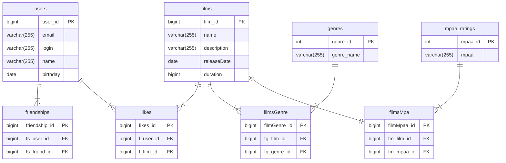

## ER-диограмма

```mermaid
erDiagram
    users {
        bigint user_id PK
        varchar(255) email
        varchar(255) login
        varchar(255) name
        date birthday
    }
    films {
        bigint film_id PK
        varchar(255) name
        varchar(255) description
        date releaseDate
        bigint duration
    }
    friendships {
        bigint friendship_id PK
        bigint fs_user_id FK
        bigint fs_friend_id FK
    }
    likes {
        bigint likes_id PK
        bigint l_user_id FK
        bigint l_film_id FK
    }
    genres {
        int genre_id PK
        varchar(255) genre_name
    }
    mpaa_ratings {
        int mpaa_id PK
        varchar(255) mpaa
    }
    filmsMpa {
        bigint filmMpaa_id PK
        bigint fm_film_id FK
        bigint fm_mpaa_id FK
    }
    filmsGenre {
        bigint filmGenre_id PK
        bigint fg_film_id FK
        bigint fg_genre_id FK
    }
    users ||--|{ friendships: ""
    films ||--|{ likes: ""
    users ||--|{ likes: ""
    films ||--|{ filmsGenre: ""
    films ||--|| filmsMpa: ""
    genres ||--|{ filmsGenre: ""
    mpaa_ratings ||--|{ filmsMpa: ""

```